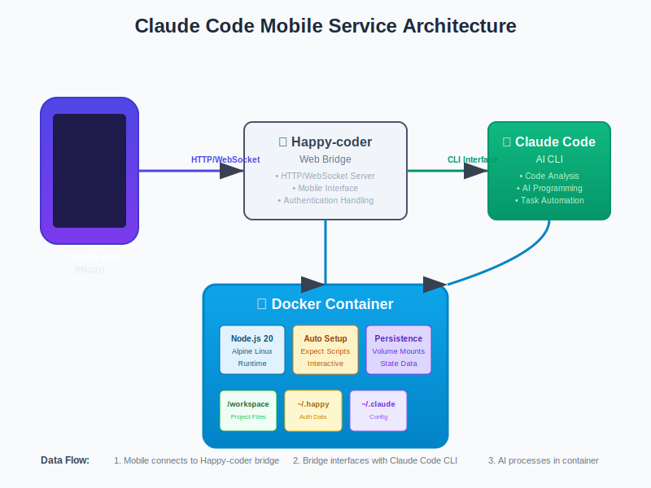

<div align="center">

# 📱 Claude Code Mobile Service

*A containerized service for mobile Claude Code access*

[](https://hub.docker.com/r/cfrs2005/claude-code-mobile)
[](https://github.com/cfrs2005/claude-code-mobile/releases)
[](https://opensource.org/licenses/MIT)
[](https://github.com/cfrs2005/happy-coder)

[**🇺🇸 English**](README.md) | [**🇨🇳 中文**](README.zh-CN.md)

**📖 Deployment Guides:**  
🏠 [Ugreen NAS Deployment Guide](docs/ugreen-nas-deployment-guide.md) | 🏠 [绿联NAS部署指南](docs/绿联NAS部署手册.md)

</div>

## Overview

Claude Code Mobile Service bridges the gap between powerful AI coding assistance and mobile accessibility. This containerized solution allows developers to access Claude Code from their smartphones using the Happy-coder mobile interface, enabling coding workflows anywhere, anytime.

## ✨ Key Features

| Feature | Description |
|---------|-------------|
| 📱 **Mobile-First** | Full Claude Code functionality on mobile devices |
| 🐳 **Containerized** | One-click deployment with Docker |
| 🔧 **Auto-Setup** | Zero-configuration startup with intelligent automation |
| 💾 **Persistent State** | Authentication and project data survive restarts |
| 🚀 **Production Ready** | Multi-architecture Docker Hub images |
| 🔒 **Secure** | Token-based authentication with volume isolation |

## 🏗️ Architecture

<div align="center">



</div>

Claude Code Mobile Service creates a bridge between your mobile device and Claude Code AI, running in a containerized environment that handles all the complexity of setup and authentication.

## 🚀 Quick Start

### Prerequisites
- Docker & Docker Compose
- Anthropic API token
- Mobile device with Happy app

### Installation

**Option 1: From Docker Hub (Recommended)**
```bash
# Clone configuration
git clone https://github.com/cfrs2005/claude-code-mobile.git
cd claude-code-mobile

# Configure your API token
cp config.env.example config.env
nano config.env  # Add your ANTHROPIC_AUTH_TOKEN

# Start service (first time - for authentication setup)
docker-compose -f docker-compose.prod.yml up -d

# Complete Happy authentication (REQUIRED for first time)
docker exec -it claude-code-mobile_happycoder_1 happy

# Restart service (authentication now persisted)
docker-compose -f docker-compose.prod.yml restart
```

**Option 2: Build from source**
```bash
git clone https://github.com/cfrs2005/claude-code-mobile.git
cd claude-code-mobile
cp config.env.example config.env
# Edit config.env with your token

# First time build and start
docker-compose up --build -d

# Complete Happy authentication (REQUIRED for first time)
docker exec -it claude-code-mobile_happycoder_1 happy

# Restart service (authentication now persisted)
docker-compose restart
```

### Mobile Connection
1. Install Happy app on your device
2. Connect to your server's IP address
3. Start coding on mobile!

## 🔧 Configuration

### Environment Variables (`config.env`)
```env
# Required
ANTHROPIC_AUTH_TOKEN=your_anthropic_api_token_here

# Optional  
ANTHROPIC_BASE_URL=https://api.anthropic.com
CLAUDE_CODE_AUTO_START=true
```

### Volume Mounts
| Local Path | Container Path | Purpose |
|------------|---------------|---------|
| `./workspace/` | `/workspace` | Your project files |
| `./claude-config/` | `/root/.claude/` | Claude settings |
| `./happy-auth/` | `/root/.happy/` | Authentication data |
| `config.env` | `/config/config.env` | Environment variables |

## 📚 Advanced Usage

### Development Commands
```bash
# View service logs
docker-compose logs -f

# Access container shell
docker exec -it claude-code-mobile_happycoder_1 bash

# Restart service  
docker-compose restart

# Update to latest version
docker-compose pull && docker-compose up -d
```

### Troubleshooting
| Issue | Solution |
|-------|----------|
| Service won't start | Check API token in `config.env` |
| Mobile can't connect | Verify firewall settings and container status |
| Authentication fails | Delete `./happy-auth/` and restart |

## 🚢 Production Deployment

For production environments, use the pre-built Docker Hub images:

```yaml
# docker-compose.prod.yml
version: '3.8'
services:
  happycoder:
    image: cfrs2005/claude-code-mobile:latest
    # ... volume mounts and config
```

## 🤝 Contributing

1. Fork the repository
2. Create feature branch: `git checkout -b feature/amazing-feature`
3. Commit changes: `git commit -m 'Add amazing feature'`
4. Push to branch: `git push origin feature/amazing-feature`
5. Open Pull Request

## 📞 Support & Feedback

- 🐛 [Report Issues](https://github.com/cfrs2005/claude-code-mobile/issues)
- 💬 [Feature Requests](https://github.com/cfrs2005/claude-code-mobile/discussions)
- 📖 [Documentation](https://github.com/cfrs2005/claude-code-mobile/wiki)

## 📄 License

This project is licensed under the MIT License - see the [LICENSE](LICENSE) file for details.

---

<div align="center">

**⭐ Star this project if it helps you!**

Made with ❤️ by [cfrs2005](https://github.com/cfrs2005)

</div>