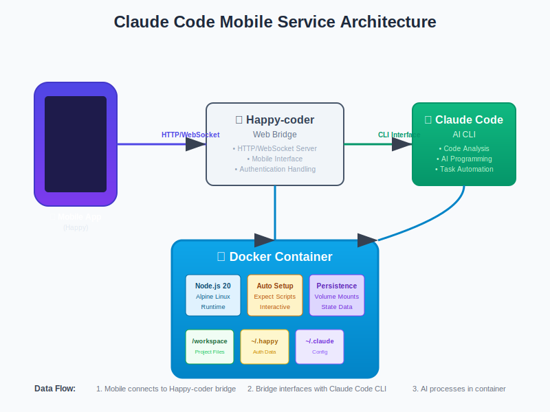

<div align="center">

# 📱 Claude Code 移动服务

*为移动设备提供 Claude Code 访问的容器化服务*

[](https://hub.docker.com/r/cfrs2005/claude-code-mobile)
[](https://github.com/cfrs2005/claude-code-mobile/releases)
[](https://opensource.org/licenses/MIT)
[](https://github.com/cfrs2005/happy-coder)

[**🇺🇸 English**](README.md) | [**🇨🇳 中文**](README.zh-CN.md)

**📖 部署指南：**  
🏠 [绿联NAS部署指南](docs/绿联NAS部署手册.md) | 🏠 [Ugreen NAS Deployment Guide](docs/ugreen-nas-deployment-guide.md)

</div>

## 项目概述

Claude Code 移动服务是一个容器化解决方案，让开发者能够通过智能手机访问强大的 Claude Code AI 编程助手。通过 Happy-coder 移动界面，实现随时随地的智能编程体验。

## ✨ 核心特性

| 特性 | 说明 |
|------|------|
| 📱 **移动优先** | 手机端完整的 Claude Code 功能体验 |
| 🐳 **容器化部署** | Docker 一键部署，简单可靠 |
| 🔧 **智能配置** | 零配置启动，自动化处理交互 |
| 💾 **状态持久化** | 认证和项目数据重启后自动恢复 |
| 🚀 **生产就绪** | 多架构 Docker Hub 官方镜像 |
| 🔒 **安全可靠** | 基于令牌认证和卷隔离保护 |

## 🏗️ 系统架构

<div align="center">



</div>

Claude Code 移动服务在你的手机和 Claude Code AI 之间创建了一个桥梁，运行在容器化环境中，自动处理所有复杂的设置和认证流程。

## 🚀 快速开始

### 系统要求
- Docker 和 Docker Compose
- Anthropic API 令牌
- 安装了 Happy 应用的移动设备

### 安装部署

**方式一：使用 Docker Hub 镜像（推荐）**
```bash
# 克隆配置文件
git clone https://github.com/cfrs2005/claude-code-mobile.git
cd claude-code-mobile

# 配置 API 令牌
cp config.env.example config.env
nano config.env  # 添加你的 ANTHROPIC_AUTH_TOKEN

# 首次启动服务（用于认证配置）
docker-compose -f docker-compose.prod.yml up -d

# 完成 Happy 认证（首次启动必须）
docker exec -it claude-code-mobile_happycoder_1 happy

# 重启服务（认证现已持久化）
docker-compose -f docker-compose.prod.yml restart
```

**方式二：源码构建**
```bash
git clone https://github.com/cfrs2005/claude-code-mobile.git
cd claude-code-mobile
cp config.env.example config.env
# 编辑 config.env 添加你的令牌

# 首次构建和启动
docker-compose up --build -d

# 完成 Happy 认证（首次启动必须）
docker exec -it claude-code-mobile_happycoder_1 happy

# 重启服务（认证现已持久化）
docker-compose restart
```

### 手机连接步骤
1. 在手机上安装 Happy 应用
2. 连接到你服务器的 IP 地址  
3. 开始移动端智能编程！

## 🔧 配置说明

### 环境变量配置 (`config.env`)
```env
# 必填项
ANTHROPIC_AUTH_TOKEN=your_anthropic_api_token_here

# 可选项
ANTHROPIC_BASE_URL=https://api.anthropic.com  
CLAUDE_CODE_AUTO_START=true
```

### 数据卷挂载
| 本地路径 | 容器路径 | 用途说明 |
|----------|----------|----------|
| `./workspace/` | `/workspace` | 你的项目代码文件 |
| `./claude-config/` | `/root/.claude/` | Claude 配置和设置 |
| `./happy-auth/` | `/root/.happy/` | Happy 认证数据 |
| `config.env` | `/config/config.env` | 环境变量配置 |

## 📚 高级用法

### 开发管理命令
```bash
# 查看服务运行日志
docker-compose logs -f

# 进入容器命令行调试
docker exec -it claude-code-mobile_happycoder_1 bash

# 重启服务
docker-compose restart

# 更新到最新版本
docker-compose pull && docker-compose up -d
```

### 常见问题排查
| 问题现象 | 解决方案 |
|----------|----------|
| 服务无法启动 | 检查 `config.env` 中 API 令牌是否正确 |
| 手机无法连接 | 验证服务器防火墙设置和容器运行状态 |
| 认证反复失败 | 删除 `./happy-auth/` 目录后重新启动 |
| 项目文件找不到 | 确认文件放在 `./workspace/` 目录中 |

## 🚢 生产环境部署

生产环境推荐使用预构建的 Docker Hub 镜像：

```bash
# 使用生产配置启动
docker-compose -f docker-compose.prod.yml up -d

# 检查服务运行状态
docker-compose ps

# 查看服务日志
docker-compose logs happycoder
```

## 🤝 参与贡献

1. Fork 本仓库到你的账号
2. 创建功能分支：`git checkout -b feature/新功能名`
3. 提交代码更改：`git commit -m '添加新功能'`
4. 推送到你的分支：`git push origin feature/新功能名`
5. 提交 Pull Request 请求合并

## 📞 支持与反馈

- 🐛 [报告问题](https://github.com/cfrs2005/claude-code-mobile/issues)
- 💬 [功能建议](https://github.com/cfrs2005/claude-code-mobile/discussions)
- 📖 [查看文档](https://github.com/cfrs2005/claude-code-mobile/wiki)
- 🌟 [项目主页](https://github.com/cfrs2005/claude-code-mobile)

## 📄 开源协议

本项目采用 MIT 开源协议 - 详情请查看 [LICENSE](LICENSE) 文件。

---

<div align="center">

**⭐ 如果这个项目对你有帮助，请给个 Star 支持！**

用 ❤️ 制作 by [cfrs2005](https://github.com/cfrs2005)

</div>