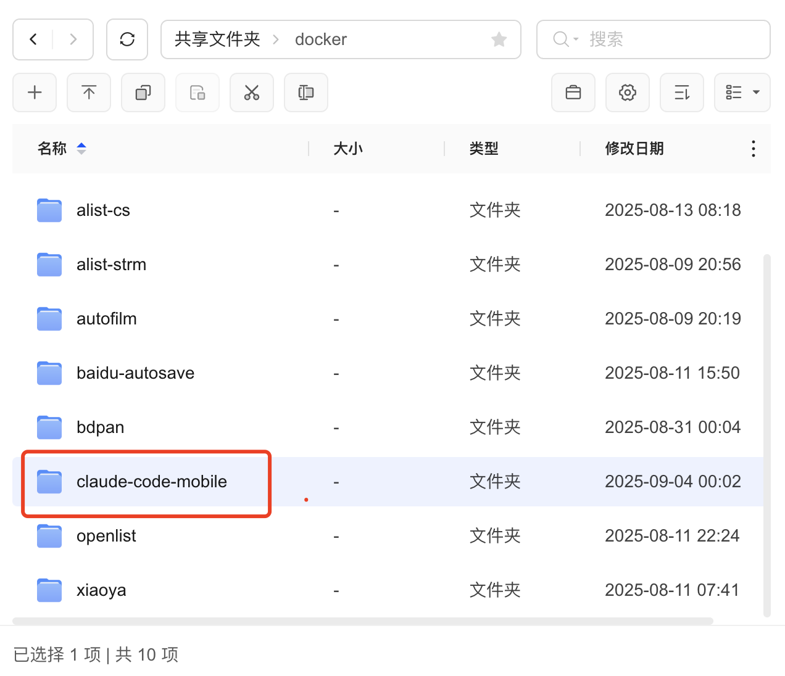
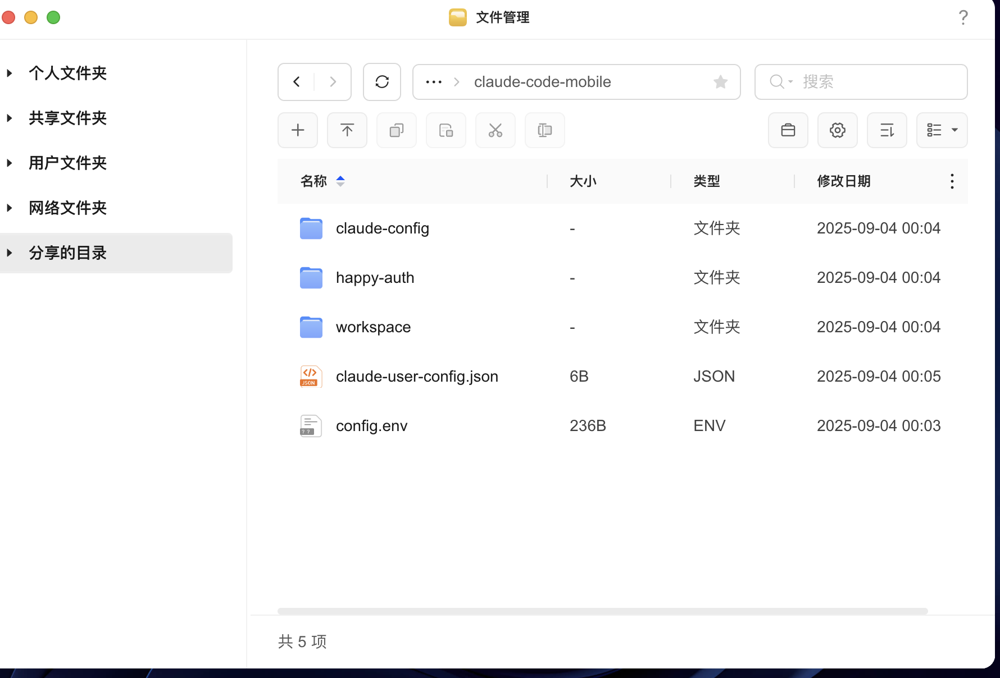
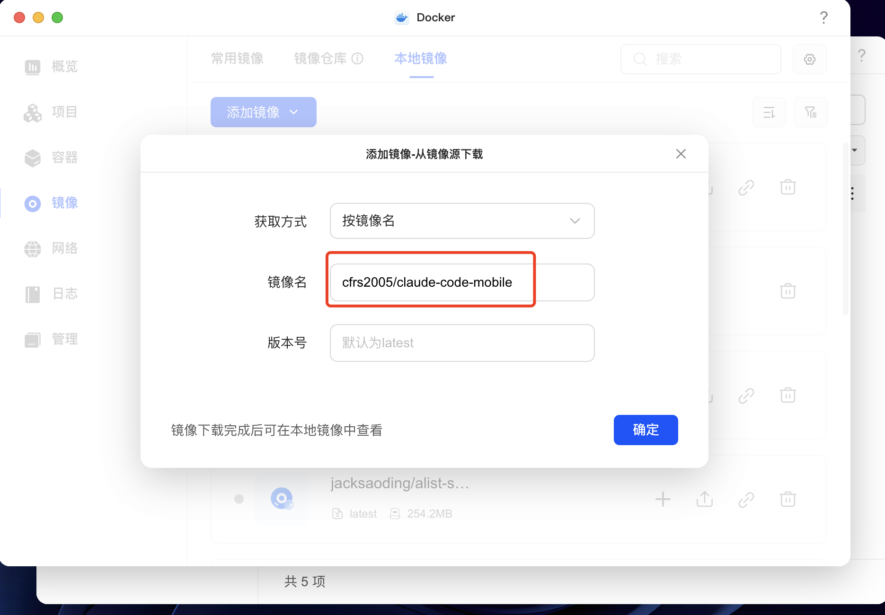
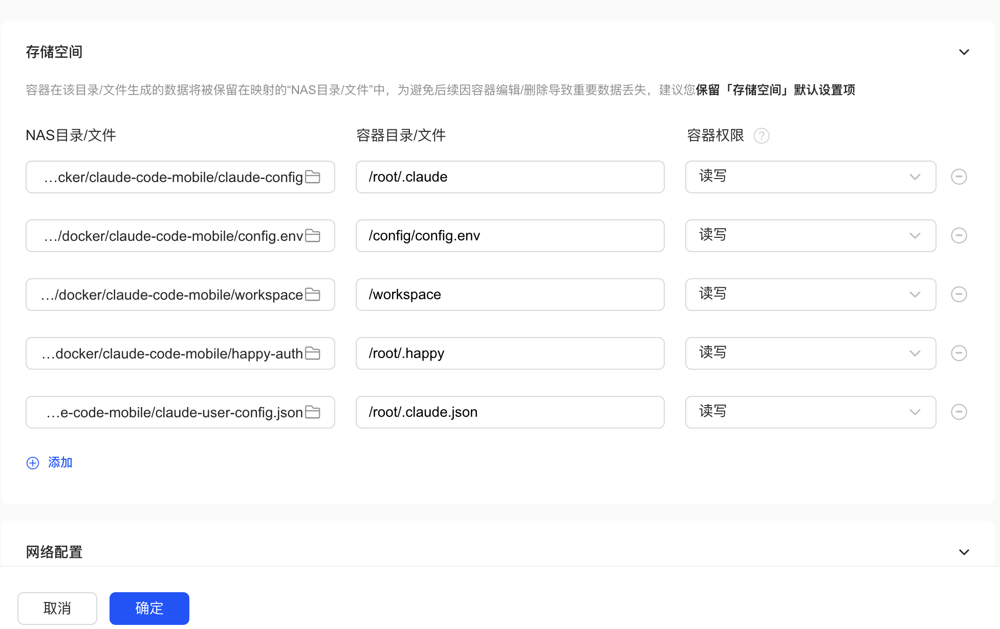
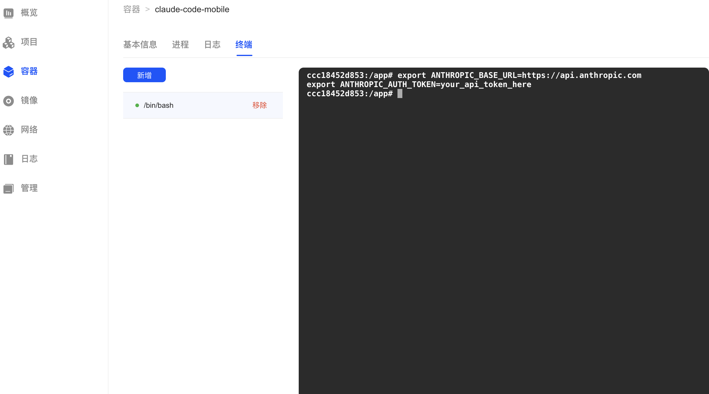
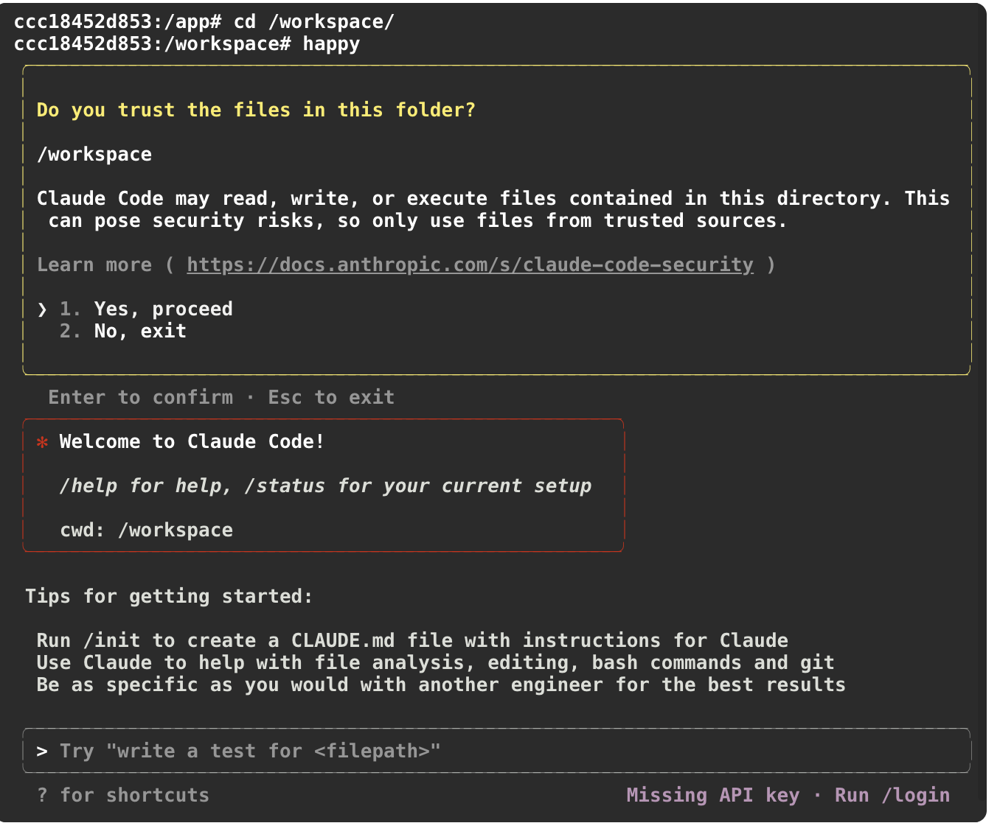
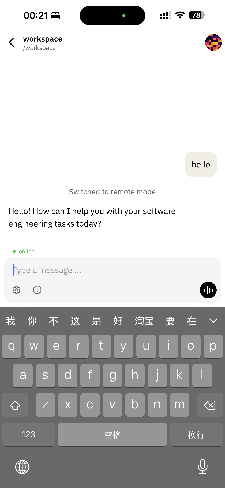

# Complete Guide to Deploying Claude Code Mobile Service on Ugreen NAS

## 🎯 Deployment Overview

This guide provides detailed instructions for deploying Claude Code Mobile Service on Ugreen NAS devices, enabling remote access to AI programming assistance through mobile devices.

## 📋 Prerequisites

### Hardware Requirements
- Ugreen NAS device (with Docker support)
- Mobile device (with Happy app installed)
- Stable network connection

### Software Requirements
- Ugreen NAS system with Docker functionality enabled
- Anthropic API token
- Happy mobile app (download from app store)

## 🚀 Detailed Deployment Steps

### Step 1: Prepare Project Files

1. **Create Project Directory**
   - Open Ugreen NAS file manager and navigate to "Shared Folders/docker" directory
   - Create a new folder named "claude-code-mobile"

   

2. **Upload Project Files**
   - Upload the following core files to the claude-code-mobile directory:
     - `config.env.example` (configuration template)
     - `claude-user-config.json` (user configuration file)
   - Create necessary subdirectories: `claude-config`, `happy-auth`, `workspace`

   

### Step 2: Configure Docker Environment

3. **Pull Docker Image**
   - Open Ugreen NAS Docker management interface
   - Select the "Images" tab
   - Click "Add Image" → "By Image Name"
   - Enter image name: `cfrs2005/claude-code-mobile`
   - Version: `latest`

   
   - Click "OK" and wait for image download to complete

### Step 3: Create and Configure Container

4. **Create Container and Configure Storage**

   

   - On the "Containers" page, click the "Create" button
   - Select image: `cfrs2005/claude-code-mobile (latest)`
   - In the storage configuration interface, set up the following volume mappings:

1. Configure Container Files

   

   | NAS Directory/File | Container Directory/File | Container Permissions | Description |
   |-------------------|--------------------------|---------------------|-------------|
   | `.../docker/claude-code-mobile/claude-config` | `/root/.claude` | Read/Write | Claude configuration directory |
   | `.../docker/claude-code-mobile/config.env` | `/config/config.env` | Read/Write | Environment variable configuration |
   | `.../docker/claude-code-mobile/workspace` | `/workspace` | Read/Write | Project working directory |
   | `.../docker/claude-code-mobile/happy-auth` | `/root/.happy` | Read/Write | Happy authentication data |
   | `.../docker/claude-code-mobile/claude-user-config.json` | `/root/.claude.json` | Read/Write | Claude user configuration |

### Step 4: Initial Startup and Authentication

5. **Start Container**
   - Click "OK" to create the container
   - Container will start automatically after creation
   - Check container list for "Running" status
   - Create terminal access to enter container

   

6. **Configure API Token**
   - Edit the `config.env` file and add your Anthropic API token:
   ```env
   export ANTHROPIC_BASE_URL=https://api.anthropic.com
   export ANTHROPIC_AUTH_TOKEN=your_api_token_here
   export CLAUDE_CODE_AUTO_START=true
   ```

7. **Complete Initial Authentication**
   - Click the container's "Terminal" tab

   
   - Switch to directory: `cd /workspace`
   - Execute in terminal: `happy`
   - Follow prompts to complete security confirmation (select "1. Yes, proceed")
     - Claude Code will start and display welcome information

1. Restart Process

   

### Step 5: Mobile Connection

8. **Configure Mobile Access**
   - Ensure container is running normally, with "Remote Mode - Claude Messages" visible in logs
   - Open Happy app on your mobile device
   - Connect to your Ugreen NAS IP address
   - After successful connection, you'll see "Switched to remote mode"

   

9. **Start Using**
    - You can now use full Claude Code functionality on your mobile device
    - Default working directory is `/workspace` for your project files
    - All authentication and configuration data is persistently saved

## 🔧 Advanced Configuration and Management

### Container Management Operations

**Restart Container**
- Find the claude-code-mobile container in the container list
- Click the right-side menu and select "Restart"

**View Logs**
- Click the container's "Logs" tab to check running status
- Monitor startup process and error messages

**Resource Monitoring**
- View CPU and memory usage in container details page
- Normal operation: ~1% CPU usage, ~274MB memory usage

### Storage Management

**Persistent Data Directory Descriptions**
- `claude-config/`: Claude Code configuration and cache data
- `happy-auth/`: Happy authentication credentials and session data  
- `workspace/`: Your project code and files
- `config.env`: Environment variables and API configuration

**Backup Recommendations**
- Regularly backup `config.env` and authentication directories
- `workspace` directory contains project files, recommend configuring automatic backup

## 🛠️ Troubleshooting

### Common Issues and Solutions

**Issue 1: Container fails to start**
- Check if API token is correctly configured in `config.env`
- Verify Docker service is running normally on NAS
- Check container logs for specific error information

**Issue 2: Mobile device cannot connect**
- Confirm container status is "Running"
- Check NAS firewall settings, ensure ports are not blocked
- Verify mobile device and NAS are on the same network

**Issue 3: Repeated authentication failures**
- Delete contents of `happy-auth` directory
- Restart container
- Re-execute `happy` command in terminal

**Issue 4: Claude Code prompts missing API key**
- Confirm token format is correct in `config.env` file
- Restart container to apply environment variables
- Check Anthropic account API quota

## 🔒 Security Considerations

### Sensitive Information Protection
- **Never** commit `config.env` with real API tokens to code repositories
- Regularly rotate API tokens
- Limit network access permissions for NAS device

### Access Control
- Configure Ugreen NAS user permissions to restrict Docker management access
- Use strong passwords to protect NAS management account
- Consider configuring VPN access for enhanced security

## 📱 Mobile Usage Tips

### Happy App Optimization
- Recommend setting fixed IP address configuration for Happy app on mobile
- Create desktop shortcuts for quick access
- Supports both landscape and portrait modes, adjust based on programming needs

### Project File Management
- Upload project files directly to `workspace` directory through NAS file manager
- Supports drag-and-drop upload for easy transfer from computer
- Can create and edit project files directly on mobile

## 🔄 Maintenance and Updates

### Regular Maintenance Tasks
- Monthly check for Docker image updates
- Clean up expired log files
- Backup important configuration and project data

### Version Update Process
```bash
# Execute in NAS terminal
docker pull cfrs2005/claude-code-mobile:latest
docker-compose restart
```

## 📞 Technical Support

Troubleshooting order when encountering issues:
1. Check container running status and logs
2. Verify network connection and firewall configuration  
3. Confirm API token and authentication status
4. Review project GitHub page issues and documentation
5. Submit new issue on GitHub repository for help

---

With these steps, you can successfully deploy Claude Code Mobile Service on your Ugreen NAS and enjoy AI programming experience anytime, anywhere! 🎉