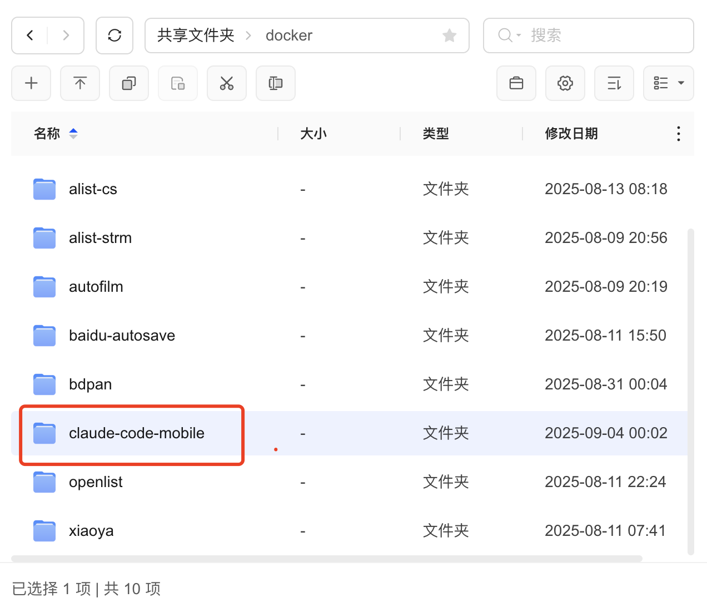
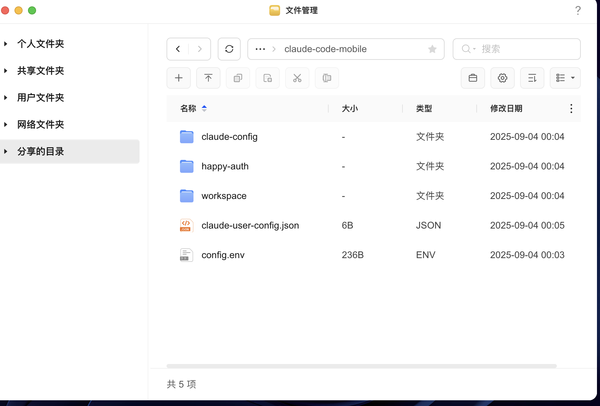
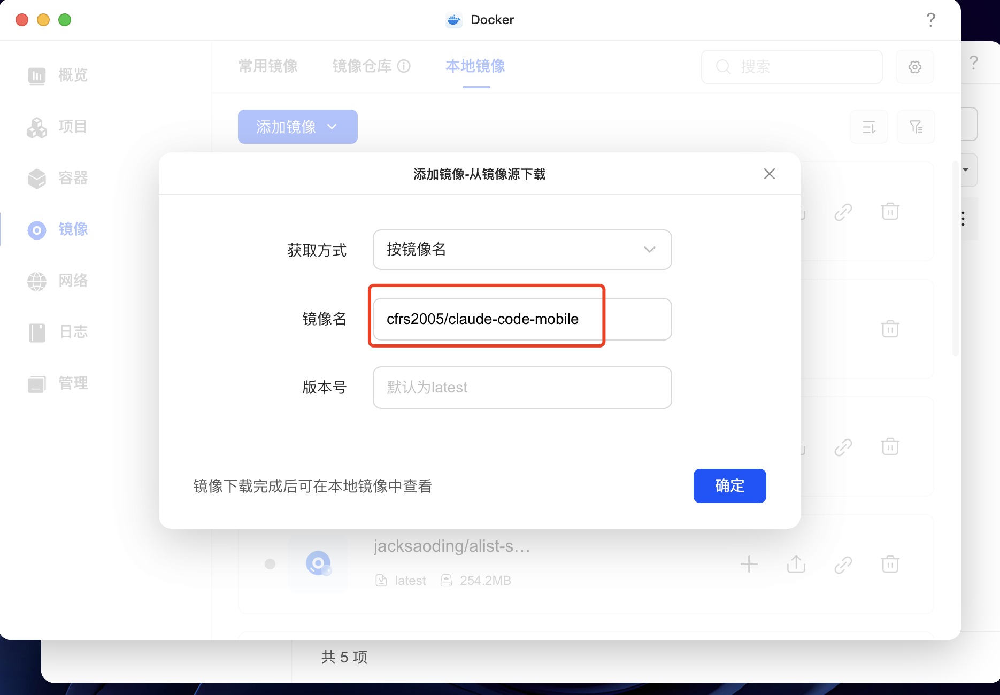
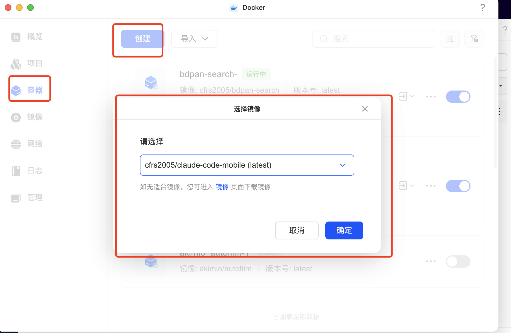
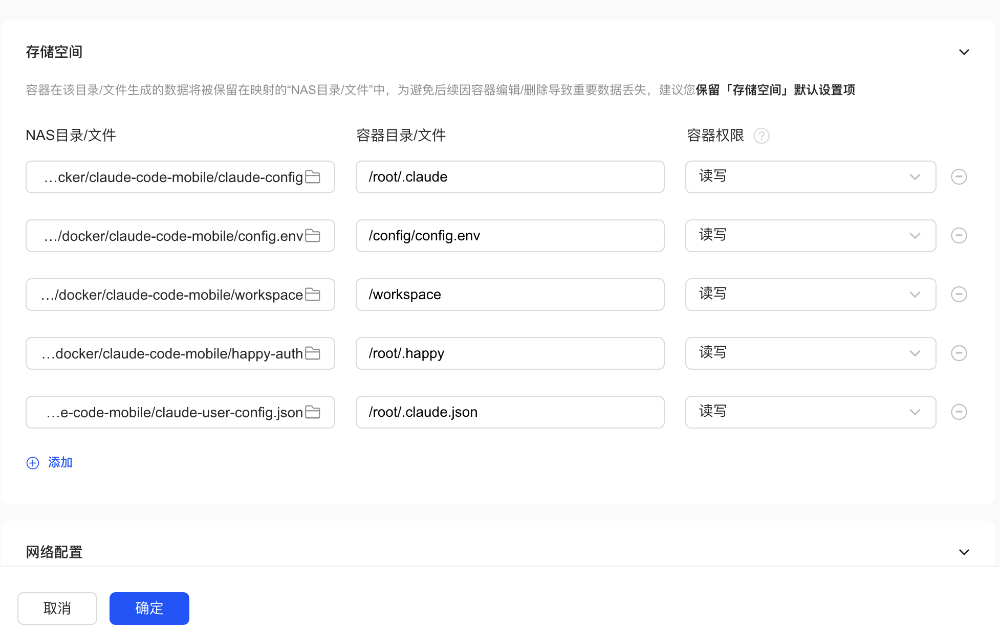
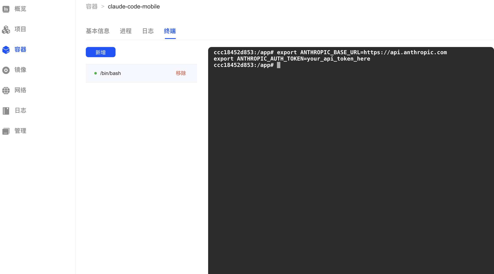
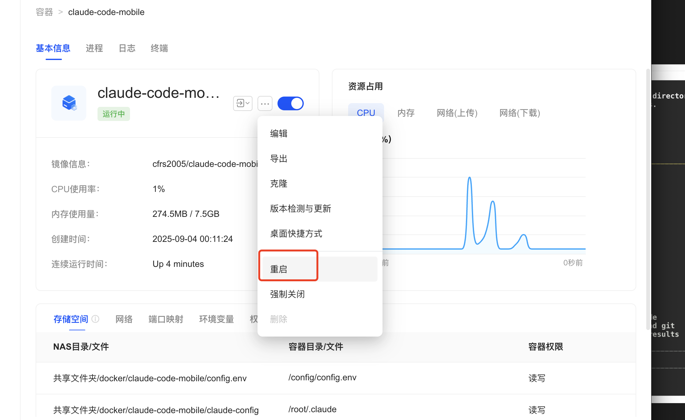
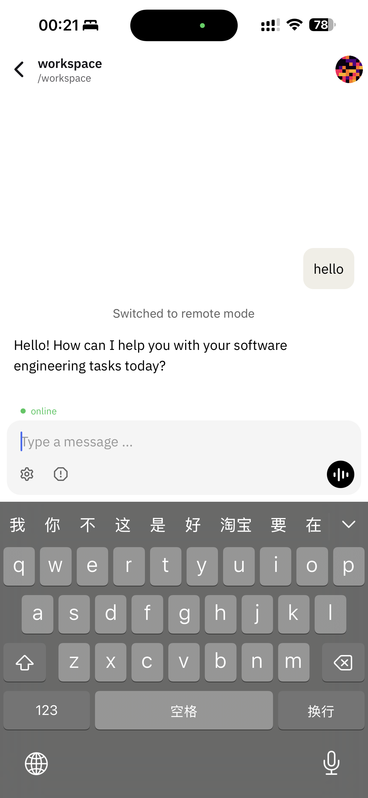

# 绿联NAS部署Claude Code Mobile Service完整指南

## 🎯 部署概述

本指南将详细介绍如何在绿联NAS设备上部署Claude Code Mobile Service，实现通过手机远程访问AI编程助手的完整流程。

## 📋 前置准备

### 硬件要求
- 绿联NAS设备（支持Docker）
- 手机设备（安装Happy应用）
- 稳定的网络连接

### 软件要求
- 绿联NAS系统已启用Docker功能
- Anthropic API令牌
- Happy移动应用（从应用商店下载）

## 🚀 详细部署步骤

### 第一步：准备项目文件

1. **创建项目目录**
   - 在绿联NAS文件管理器中进入"共享文件夹/docker"目录
   - 创建名为"claude-code-mobile"的文件夹

   

2. **上传项目文件**
   - 将以下核心文件上传到claude-code-mobile目录：
     - `config.env.example` （配置模板）
     - `claude-user-config.json` （用户配置文件）
   - 创建必要的子目录：`claude-config`, `happy-auth`, `workspace`

   

### 第二步：配置Docker环境

3. **拉取Docker镜像**
   - 打开绿联NAS Docker管理界面
   - 选择"镜像"标签页
   - 点击"添加镜像" → "按镜像名"
   - 输入镜像名：`cfrs2005/claude-code-mobile`
   - 版本号：`latest`

   
   - 点击"确定"等待镜像下载完成

### 第三步：创建和配置容器

4. **创建容器并配置存储空间**

   

   - 在"容器"页面点击"创建"按钮
   - 选择镜像：`cfrs2005/claude-code-mobile (latest)`
   - 在存储空间配置界面设置以下卷映射：


1. 配置容器文件

   


   | NAS目录/文件 | 容器目录/文件 | 容器权限 | 说明 |
   |-------------|--------------|----------|------|
   | `.../docker/claude-code-mobile/claude-config` | `/root/.claude` | 读写 | Claude配置目录 |
   | `.../docker/claude-code-mobile/config.env` | `/config/config.env` | 读写 | 环境变量配置 |
   | `.../docker/claude-code-mobile/workspace` | `/workspace` | 读写 | 项目工作目录 |
   | `.../docker/claude-code-mobile/happy-auth` | `/root/.happy` | 读写 | Happy认证数据 |
   | `.../docker/claude-code-mobile/claude-user-config.json` | `/root/.claude.json` | 读写 | Claude用户配置 |

### 第四步：首次启动和认证

5. **启动容器**
   - 点击"确定"创建容器
   - 容器创建后会自动启动
   - 在容器列表中可以看到"运行中"状态
   - 创建中终端，进入容器

   

6. **配置API令牌**
   - 编辑`config.env`文件，添加你的Anthropic API令牌：
   ```env
   export ANTHROPIC_BASE_URL=https://api.anthropic.com
   export ANTHROPIC_AUTH_TOKEN=your_api_token_here
   export CLAUDE_CODE_AUTO_START=true
   ```

7. **完成首次认证**
   - 点击容器的"终端"标签

   
   - 切换到目录: `cd /workspace`
   - 在终端中执行：`happy`
   - 按提示完成安全确认（选择"1. Yes, proceed"）
     - Claude Code将启动并显示欢迎信息


1. 重启 流程

   

### 第五步：移动端连接

8. **配置移动端访问**
   - 确保容器正常运行，可在日志中看到"Remote Mode - Claude Messages"
   - 在手机上打开Happy应用
   - 连接到你的绿联NAS IP地址
   - 成功连接后可以看到"Switched to remote mode"

   

9. **开始使用**
    - 在手机上即可使用完整的Claude Code功能
    - 工作目录默认为`/workspace`，可放置你的项目文件
    - 所有认证和配置数据会持久保存

## 🔧 高级配置和管理

### 容器管理操作

**重启容器**
- 在容器列表中找到claude-code-mobile容器
- 点击右侧菜单选择"重启"

**查看日志**
- 点击容器的"日志"标签查看运行状态
- 可以监控启动过程和错误信息

**资源监控**
- 在容器详情页可以查看CPU和内存使用情况
- 正常运行时CPU使用率约1%，内存使用约274MB

### 存储管理

**数据持久化目录说明**
- `claude-config/`: Claude Code的配置和缓存数据
- `happy-auth/`: Happy认证凭据和会话数据  
- `workspace/`: 你的项目代码和文件
- `config.env`: 环境变量和API配置

**备份建议**
- 定期备份`config.env`和认证目录
- `workspace`目录包含项目文件，建议配置自动备份

## 🛠️ 故障排除

### 常见问题和解决方案

**问题1：容器无法启动**
- 检查API令牌是否正确配置在`config.env`中
- 确认NAS上Docker服务正常运行
- 查看容器日志获取具体错误信息

**问题2：手机无法连接**
- 确认容器状态为"运行中"
- 检查NAS防火墙设置，确保端口未被阻塞
- 验证手机和NAS在同一网络环境

**问题3：认证反复失败**
- 删除`happy-auth`目录内容
- 重启容器
- 重新执行终端中的`happy`命令

**问题4：Claude Code提示缺少API密钥**
- 确认`config.env`文件中的令牌格式正确
- 重启容器使环境变量生效
- 检查Anthropic账户API配额

## 🔒 安全注意事项

### 敏感信息保护
- **永远不要**将包含真实API令牌的`config.env`提交到代码仓库
- 定期轮换API令牌
- 限制NAS设备的网络访问权限

### 访问控制
- 配置绿联NAS的用户权限，限制Docker管理访问
- 使用强密码保护NAS管理账户
- 考虑配置VPN访问以提高安全性

## 📱 移动端使用技巧

### Happy应用优化
- 建议在手机上固定Happy应用IP地址配置
- 可以创建桌面快捷方式方便快速访问
- 支持横屏和竖屏模式，根据编程需要调整

### 项目文件管理
- 通过NAS文件管理器可以直接上传项目文件到`workspace`目录
- 支持拖拽上传，方便从电脑传输代码
- 可以直接在手机上创建和编辑项目文件

## 🔄 维护和更新

### 定期维护任务
- 每月检查Docker镜像更新
- 清理过期的日志文件
- 备份重要的配置和项目数据

### 版本更新流程
```bash
# 在NAS终端中执行
docker pull cfrs2005/claude-code-mobile:latest
docker-compose restart
```

## 📞 技术支持

遇到问题时的排查顺序：
1. 检查容器运行状态和日志
2. 验证网络连接和防火墙配置  
3. 确认API令牌和认证状态
4. 查阅项目GitHub页面的issue和文档
5. 在GitHub仓库提交新的issue寻求帮助

---

通过以上步骤，你就可以在绿联NAS上成功部署Claude Code Mobile Service，实现随时随地的AI编程体验！🎉